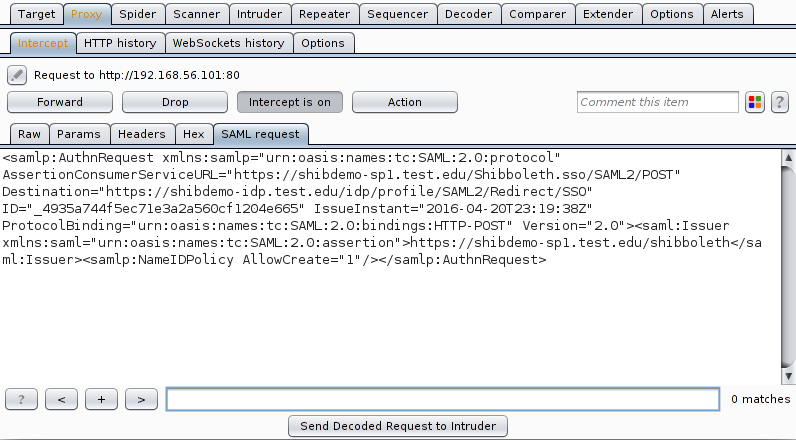
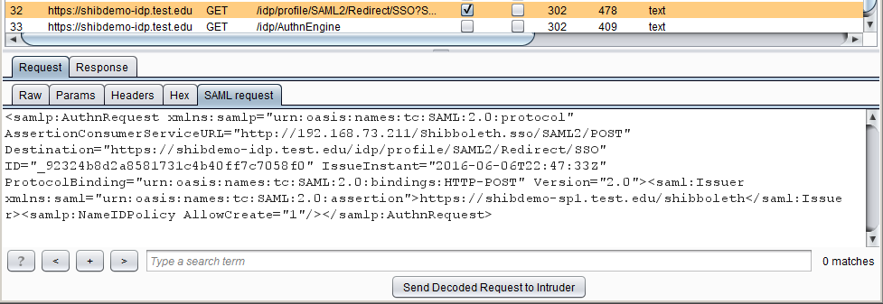
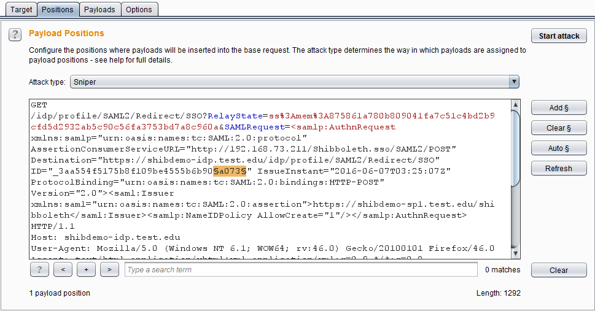

#SAML ReQuest Burpsuite extension

Security Assertion Markup Language (SAML) is used in many SSO implementations, which authenticate the user once to access several Service Providers (SP). When a user tries to access a SP, it redirects the user to an Identification Provider (IdP) and adds "SAML authentication request" to the redirection request, to which the user is authenticated according. 
SAML ReQuest Burp extension enables pentesters to view, decode and modify SAML Authentication requests and test IdP's response to their manipulations. It supports the following features:
- Decoding SAML authentication requests, whether compressed in the URL (HTTP Redirection Binding) or not compressed in POST body (HTTP POST Binding)
- Displays the decoded SAML authentication request in Proxy Intercept, Proxy History and Repeater tabs

- In case of Intercept and Repeater, if the decoded authentication request is modified, the encoded request changed accordingly.
- From any SAML Request tab, you can send the decoded request to Intruder, by clicking on “Send Decoded Request to Intruder“ button at the bottom of the tab. 

In this case, SAMLRequest parameter in the intruder tab decoded, so the user can set the payload positions. The parameter in the Intruder Results window is also decoded. But of course the request is eventually sent with an encoded SAMLRequest parameter.

Note: When a request is sent to intruder, it is configured to send the request over HTTPS. So in case the system under test uses HTTP and not HTTPS, keep in mind to change the port and protocol in Intruder-Target tab.

